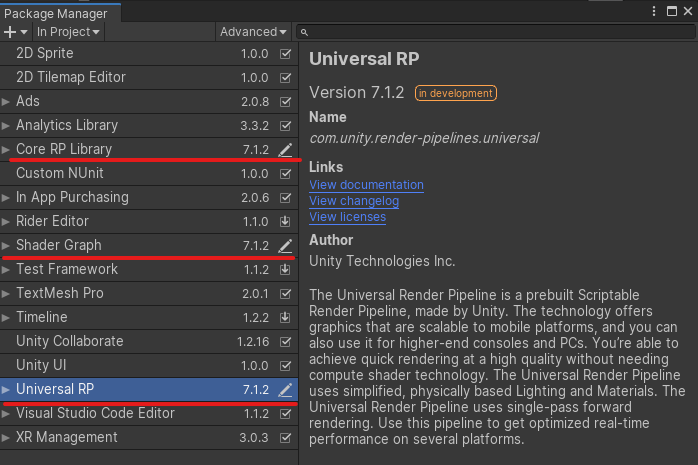
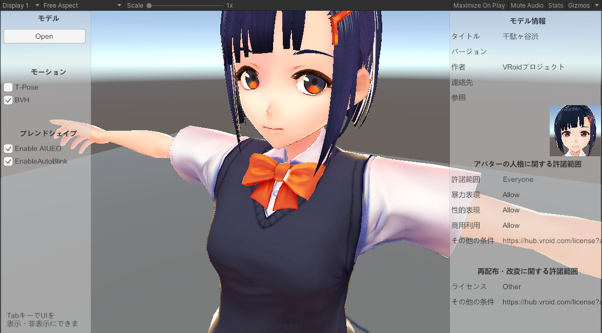
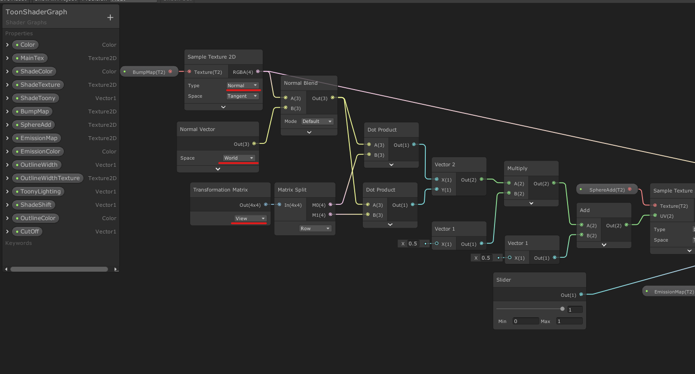
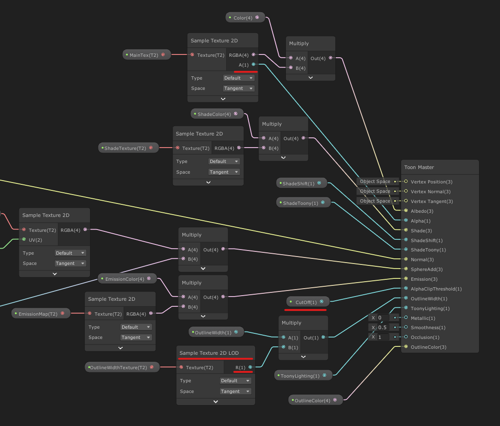

# VRM Toon Shader Graph for Universal RP

[VRM - 3D Avatar File Format for VR -](https://vrm.dev/en/)

# Requirements
Unity 2019.3.0f3  
Universal RP template project  
 - Universal RP 7.1.7
 - Shader Graph 7.1.7

# Usage of this Toon Shader  
1. Craete Universaal RP Template project or Open this project
1. Update Universal RP versions to v7.1.7 in Menu Window > Package Manager
1. Move UnityProjectDir/Library/PackageCache to UnityProjectDir/Packages of ...  
    1. com.unity.render-pipelines.core@7.1.7
    1. com.unity.render-pipelines.universal@7.1.7
    1. com.unity.shadergraph@7.1.7  

    Now, you can see <font color="Red">pen icon</font> in Menu Window > Package Manager  
      
    Ready to edit package shader files.

1. Move this repository scripts and shader files  
    UnityProjectDir/MoveFiles child folders name indicates move destination folder paths.

1. Use "Shader Graphs/ToonShaderGraph" for your game!
    1. The file location is VRM-Toon-for-Universal-RP\Assets\ToonShaderGraph\ToonShaderGraph.shadergraph

# Check Example VRM Scene

1. Find VRMMaterialImporter if you use [UniVRM package](https://github.com/vrm-c/UniVRM)  
    Edit lines as follows.
 ```cs
 // 1 select shader
 var shaderName = item.shader;
 ↓
 var shaderName = "Shader Graphs/ToonShaderGraph";//item.shader;

 // 2 use geometry queue
 material.renderQueue = item.renderQueue;
 ↓
 material.renderQueue = (int)UnityEngine.Rendering.RenderQueue.GeometryLast < item.renderQueue ? (int)UnityEngine.Rendering.RenderQueue.GeometryLast : item.renderQueue;
 ```
Load Result in SimpleViewer scene of [UniVRM Sample package](https://github.com/vrm-c/UniVRM).    


# Shader Graph Node Details
Take care <font color="Red">red underline</font> settings.

LeftSide  

RightSide  

